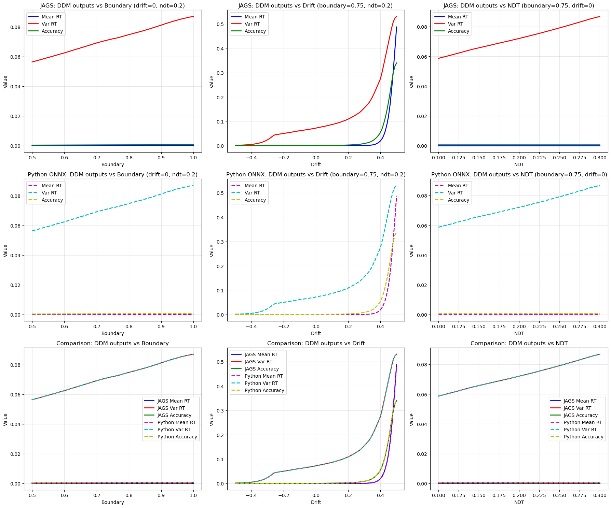

# DDM Model Compilation and Testing Workflow

This notebook provides step-by-step instructions for compiling and testing the DDM (Drift Diffusion Model) JAGS module.


## Prerequisites

Ensure you have the required dependencies installed:
- JAGS 4.3.0+
- ONNX Runtime 1.23.2+ (Linux x64)
- py2jags 0.1.0+
- Python 3.11+ with scikit-learn


## Step 1: Generate Module Code


```python
from jnnx import JNNXPackage, JAGSModule

# Generate module code using Python API
pkg = JNNXPackage('/home/jovyan/project/models/ddm.jnnx')
module = JAGSModule(pkg, 'tmp/ddm.jnnx_build')
module.generate_code()
print('Module code generated in tmp/ddm.jnnx_build')

```

    Module code generated in tmp/ddm.jnnx_build


    /opt/conda/envs/pymc/lib/python3.11/site-packages/sklearn/base.py:442: InconsistentVersionWarning: Trying to unpickle estimator MinMaxScaler from version 1.7.1 when using version 1.7.2. This might lead to breaking code or invalid results. Use at your own risk. For more info please refer to:
    https://scikit-learn.org/stable/model_persistence.html#security-maintainability-limitations
      warnings.warn(


```python
# Ensure ONNX Runtime is available at expected path for compilation
import os, tarfile, urllib.request
from pathlib import Path

onnx_dir = Path('/home/jovyan/project/tmp/onnxruntime-linux-x64-1.23.2')
if not onnx_dir.exists():
    onnx_dir.parent.mkdir(parents=True, exist_ok=True)
    url = 'https://github.com/microsoft/onnxruntime/releases/download/v1.23.2/onnxruntime-linux-x64-1.23.2.tgz'
    tgz_path = onnx_dir.parent / 'onnxruntime-linux-x64-1.23.2.tgz'
    print('Downloading ONNX Runtime...', url)
    urllib.request.urlretrieve(url, tgz_path)
    print('Extracting...', tgz_path)
    with tarfile.open(tgz_path, 'r:gz') as tf:
        tf.extractall(path=onnx_dir.parent)
    print('ONNX Runtime ready at', onnx_dir)
else:
    print('ONNX Runtime already present at', onnx_dir)

```

    ONNX Runtime already present at /home/jovyan/project/tmp/onnxruntime-linux-x64-1.23.2


## Step 2: Compile the Module


```python
# Compile using Python API
success, msg = module.compile()
if not success:
    raise RuntimeError(msg)
print('Compilation succeeded')

```

    Compilation succeeded


```python
# Install using Python API
success, msg = module.install()
if not success:
    raise RuntimeError(msg)
print('Installation succeeded')

```

    Installation succeeded


## Step 3: Test the Module


```python
import py2jags
import onnxruntime as ort
import numpy as np

# Test DDM function
model_string = '''
model {
    result <- ddm_emulator(0.5, 0.5, 0.5)
    dummy ~ dnorm(0, 1)
}
'''

result = py2jags.run_jags(
    model_string=model_string,
    data_dict={'n': 1},
    nchains=1, nsamples=1, nadapt=0, nburnin=0,
    monitorparams=['result'],
    modules=['ddm_emulator'],
    verbosity=0
)

print('DDM output:', [result.get_samples(f'result_{i+1}')[0] for i in range(3)])

```

    DDM output: [0.496954, 0.320284, 0.0849938]


    /opt/conda/envs/pymc/lib/python3.11/site-packages/numpy/core/_methods.py:206: RuntimeWarning: Degrees of freedom <= 0 for slice
      ret = _var(a, axis=axis, dtype=dtype, out=out, ddof=ddof,
    /opt/conda/envs/pymc/lib/python3.11/site-packages/numpy/core/_methods.py:198: RuntimeWarning: invalid value encountered in scalar divide
      ret = ret.dtype.type(ret / rcount)


## Step 4: Validate Against Python ONNX


```python
import onnxruntime as ort
import numpy as np
from jnnx import JNNXPackage

# Load ONNX model via API
pkg = JNNXPackage('/home/jovyan/project/models/ddm.jnnx')
session = ort.InferenceSession(pkg.get_onnx_path())
test_input = np.array([[0.5, 0.5, 0.5]], dtype=np.float32)
result = session.run(['output'], {'input': test_input})
print('Python ONNX output:', result[0][0].tolist())

```

    Python ONNX output: [0.496954083442688, 0.32028400897979736, 0.08499377965927124]


    /opt/conda/envs/pymc/lib/python3.11/site-packages/sklearn/base.py:442: InconsistentVersionWarning: Trying to unpickle estimator MinMaxScaler from version 1.7.1 when using version 1.7.2. This might lead to breaking code or invalid results. Use at your own risk. For more info please refer to:
    https://scikit-learn.org/stable/model_persistence.html#security-maintainability-limitations
      warnings.warn(


## Step 5: Compare Results


```python
# Run both tests and compare
import py2jags
import onnxruntime as ort
import numpy as np

# JAGS evaluation
model_string = '''
model {
    result <- ddm_emulator(0.5, 0.5, 0.5)
    dummy ~ dnorm(0, 1)
}
'''

jags_result = py2jags.run_jags(
    model_string=model_string,
    data_dict={'n': 1},
    nchains=1, nsamples=1, nadapt=0, nburnin=0,
    monitorparams=['result'],
    modules=['ddm_emulator'],
    verbosity=0
)

jags_output = [jags_result.get_samples(f'result_{i+1}')[0] for i in range(3)]

# Python ONNX evaluation via API
from jnnx import JNNXPackage
pkg = JNNXPackage('/home/jovyan/project/models/ddm.jnnx')
session = ort.InferenceSession(pkg.get_onnx_path())
test_input = np.array([[0.5, 0.5, 0.5]], dtype=np.float32)
onx_result = session.run(['output'], {'input': test_input})
onnx_output = onx_result[0][0].tolist()

# Compare results
print('JAGS output:  ', jags_output)
print('Python output:', onnx_output)
print('Differences:  ', [abs(jags_output[i] - onnx_output[i]) for i in range(3)])

# Check if results match within machine precision
max_diff = max([abs(jags_output[i] - onnx_output[i]) for i in range(3)])
if max_diff < 1e-6:
    print('SUCCESS: Results match within machine precision')
else:
    print('ERROR: Results differ significantly')

```

    JAGS output:   [0.496954, 0.320284, 0.0849938]
    Python output: [0.496954083442688, 0.32028400897979736, 0.08499377965927124]
    Differences:   [8.344268798143872e-08, 8.97979735015042e-09, 2.0340728754120185e-08]
    SUCCESS: Results match within machine precision


```python
# Parameter Sweep Analysis
import py2jags
import onnxruntime as ort
import numpy as np
import matplotlib.pyplot as plt
from jnnx import JNNXPackage

# Load the package and ONNX session
pkg = JNNXPackage('/home/jovyan/project/models/ddm.jnnx')
session = ort.InferenceSession(pkg.get_onnx_path())

# Define parameter ranges
boundary_values = np.linspace(0.5, 1.0, 101)
drift_values = np.linspace(-0.5, 0.5, 101)
ndt_values = np.linspace(0.1, 0.3, 101)

# Initialize arrays for results
jags_meanrt_boundary = np.zeros(101)
jags_varrt_boundary = np.zeros(101)
jags_acc_boundary = np.zeros(101)

jags_meanrt_drift = np.zeros(101)
jags_varrt_drift = np.zeros(101)
jags_acc_drift = np.zeros(101)

jags_meanrt_ndt = np.zeros(101)
jags_varrt_ndt = np.zeros(101)
jags_acc_ndt = np.zeros(101)

python_meanrt_boundary = np.zeros(101)
python_varrt_boundary = np.zeros(101)
python_acc_boundary = np.zeros(101)

python_meanrt_drift = np.zeros(101)
python_varrt_drift = np.zeros(101)
python_acc_drift = np.zeros(101)

python_meanrt_ndt = np.zeros(101)
python_varrt_ndt = np.zeros(101)
python_acc_ndt = np.zeros(101)

print("Evaluating JAGS model...")

# JAGS evaluation: boundary varies, drift=0, ndt=0.2
for i, boundary in enumerate(boundary_values):
    model_string = f'''
    model {{
        result <- ddm_emulator({boundary}, 0.0, 0.2)
        dummy ~ dnorm(0, 1)
    }}
    '''
    
    result = py2jags.run_jags(
        model_string=model_string,
        data_dict={'n': 1},
        nchains=1, nsamples=1, nadapt=0, nburnin=0,
        monitorparams=['result'],
        modules=['ddm_emulator'],
        verbosity=0
    )
    
    jags_meanrt_boundary[i] = result.get_samples('result_1')[0]
    jags_varrt_boundary[i] = result.get_samples('result_2')[0]
    jags_acc_boundary[i] = result.get_samples('result_3')[0]

# JAGS evaluation: drift varies, boundary=0.75, ndt=0.2
for i, drift in enumerate(drift_values):
    model_string = f'''
    model {{
        result <- ddm_emulator(0.75, {drift}, 0.2)
        dummy ~ dnorm(0, 1)
    }}
    '''
    
    result = py2jags.run_jags(
        model_string=model_string,
        data_dict={'n': 1},
        nchains=1, nsamples=1, nadapt=0, nburnin=0,
        monitorparams=['result'],
        modules=['ddm_emulator'],
        verbosity=0
    )
    
    jags_meanrt_drift[i] = result.get_samples('result_1')[0]
    jags_varrt_drift[i] = result.get_samples('result_2')[0]
    jags_acc_drift[i] = result.get_samples('result_3')[0]

# JAGS evaluation: ndt varies, boundary=0.75, drift=0
for i, ndt in enumerate(ndt_values):
    model_string = f'''
    model {{
        result <- ddm_emulator(0.75, 0.0, {ndt})
        dummy ~ dnorm(0, 1)
    }}
    '''
    
    result = py2jags.run_jags(
        model_string=model_string,
        data_dict={'n': 1},
        nchains=1, nsamples=1, nadapt=0, nburnin=0,
        monitorparams=['result'],
        modules=['ddm_emulator'],
        verbosity=0
    )
    
    jags_meanrt_ndt[i] = result.get_samples('result_1')[0]
    jags_varrt_ndt[i] = result.get_samples('result_2')[0]
    jags_acc_ndt[i] = result.get_samples('result_3')[0]

print("Evaluating Python ONNX model...")

# Python ONNX evaluation: boundary varies, drift=0, ndt=0.2
for i, boundary in enumerate(boundary_values):
    test_input = np.array([[boundary, 0.0, 0.2]], dtype=np.float32)
    result = session.run(['output'], {'input': test_input})
    python_meanrt_boundary[i] = result[0][0][0]
    python_varrt_boundary[i] = result[0][0][1]
    python_acc_boundary[i] = result[0][0][2]

# Python ONNX evaluation: drift varies, boundary=0.75, ndt=0.2
for i, drift in enumerate(drift_values):
    test_input = np.array([[0.75, drift, 0.2]], dtype=np.float32)
    result = session.run(['output'], {'input': test_input})
    python_meanrt_drift[i] = result[0][0][0]
    python_varrt_drift[i] = result[0][0][1]
    python_acc_drift[i] = result[0][0][2]

# Python ONNX evaluation: ndt varies, boundary=0.75, drift=0
for i, ndt in enumerate(ndt_values):
    test_input = np.array([[0.75, 0.0, ndt]], dtype=np.float32)
    result = session.run(['output'], {'input': test_input})
    python_meanrt_ndt[i] = result[0][0][0]
    python_varrt_ndt[i] = result[0][0][1]
    python_acc_ndt[i] = result[0][0][2]

print("Creating plots...")

# Create plots
fig, axes = plt.subplots(3, 3, figsize=(18, 15))

# Plot 1: DDM outputs vs boundary (JAGS)
axes[0, 0].plot(boundary_values, jags_meanrt_boundary, 'b-', label='Mean RT', linewidth=2)
axes[0, 0].plot(boundary_values, jags_varrt_boundary, 'r-', label='Var RT', linewidth=2)
axes[0, 0].plot(boundary_values, jags_acc_boundary, 'g-', label='Accuracy', linewidth=2)
axes[0, 0].set_xlabel("Boundary")
axes[0, 0].set_ylabel("Value")
axes[0, 0].set_title("JAGS: DDM outputs vs Boundary (drift=0, ndt=0.2)")
axes[0, 0].legend()
axes[0, 0].grid(True, alpha=0.3)

# Plot 2: DDM outputs vs drift (JAGS)
axes[0, 1].plot(drift_values, jags_meanrt_drift, 'b-', label='Mean RT', linewidth=2)
axes[0, 1].plot(drift_values, jags_varrt_drift, 'r-', label='Var RT', linewidth=2)
axes[0, 1].plot(drift_values, jags_acc_drift, 'g-', label='Accuracy', linewidth=2)
axes[0, 1].set_xlabel("Drift")
axes[0, 1].set_ylabel("Value")
axes[0, 1].set_title("JAGS: DDM outputs vs Drift (boundary=0.75, ndt=0.2)")
axes[0, 1].legend()
axes[0, 1].grid(True, alpha=0.3)

# Plot 3: DDM outputs vs ndt (JAGS)
axes[0, 2].plot(ndt_values, jags_meanrt_ndt, 'b-', label='Mean RT', linewidth=2)
axes[0, 2].plot(ndt_values, jags_varrt_ndt, 'r-', label='Var RT', linewidth=2)
axes[0, 2].plot(ndt_values, jags_acc_ndt, 'g-', label='Accuracy', linewidth=2)
axes[0, 2].set_xlabel("NDT")
axes[0, 2].set_ylabel("Value")
axes[0, 2].set_title("JAGS: DDM outputs vs NDT (boundary=0.75, drift=0)")
axes[0, 2].legend()
axes[0, 2].grid(True, alpha=0.3)

# Plot 4: DDM outputs vs boundary (Python)
axes[1, 0].plot(boundary_values, python_meanrt_boundary, 'm--', label='Mean RT', linewidth=2)
axes[1, 0].plot(boundary_values, python_varrt_boundary, 'c--', label='Var RT', linewidth=2)
axes[1, 0].plot(boundary_values, python_acc_boundary, 'y--', label='Accuracy', linewidth=2)
axes[1, 0].set_xlabel("Boundary")
axes[1, 0].set_ylabel("Value")
axes[1, 0].set_title("Python ONNX: DDM outputs vs Boundary (drift=0, ndt=0.2)")
axes[1, 0].legend()
axes[1, 0].grid(True, alpha=0.3)

# Plot 5: DDM outputs vs drift (Python)
axes[1, 1].plot(drift_values, python_meanrt_drift, 'm--', label='Mean RT', linewidth=2)
axes[1, 1].plot(drift_values, python_varrt_drift, 'c--', label='Var RT', linewidth=2)
axes[1, 1].plot(drift_values, python_acc_drift, 'y--', label='Accuracy', linewidth=2)
axes[1, 1].set_xlabel("Drift")
axes[1, 1].set_ylabel("Value")
axes[1, 1].set_title("Python ONNX: DDM outputs vs Drift (boundary=0.75, ndt=0.2)")
axes[1, 1].legend()
axes[1, 1].grid(True, alpha=0.3)

# Plot 6: DDM outputs vs ndt (Python)
axes[1, 2].plot(ndt_values, python_meanrt_ndt, 'm--', label='Mean RT', linewidth=2)
axes[1, 2].plot(ndt_values, python_varrt_ndt, 'c--', label='Var RT', linewidth=2)
axes[1, 2].plot(ndt_values, python_acc_ndt, 'y--', label='Accuracy', linewidth=2)
axes[1, 2].set_xlabel("NDT")
axes[1, 2].set_ylabel("Value")
axes[1, 2].set_title("Python ONNX: DDM outputs vs NDT (boundary=0.75, drift=0)")
axes[1, 2].legend()
axes[1, 2].grid(True, alpha=0.3)

# Overlay comparison plots
axes[2, 0].plot(boundary_values, jags_meanrt_boundary, 'b-', label='JAGS Mean RT', linewidth=2)
axes[2, 0].plot(boundary_values, jags_varrt_boundary, 'r-', label='JAGS Var RT', linewidth=2)
axes[2, 0].plot(boundary_values, jags_acc_boundary, 'g-', label='JAGS Accuracy', linewidth=2)
axes[2, 0].plot(boundary_values, python_meanrt_boundary, 'm--', label='Python Mean RT', linewidth=2)
axes[2, 0].plot(boundary_values, python_varrt_boundary, 'c--', label='Python Var RT', linewidth=2)
axes[2, 0].plot(boundary_values, python_acc_boundary, 'y--', label='Python Accuracy', linewidth=2)
axes[2, 0].set_xlabel("Boundary")
axes[2, 0].set_ylabel("Value")
axes[2, 0].set_title("Comparison: DDM outputs vs Boundary")
axes[2, 0].legend()
axes[2, 0].grid(True, alpha=0.3)

axes[2, 1].plot(drift_values, jags_meanrt_drift, 'b-', label='JAGS Mean RT', linewidth=2)
axes[2, 1].plot(drift_values, jags_varrt_drift, 'r-', label='JAGS Var RT', linewidth=2)
axes[2, 1].plot(drift_values, jags_acc_drift, 'g-', label='JAGS Accuracy', linewidth=2)
axes[2, 1].plot(drift_values, python_meanrt_drift, 'm--', label='Python Mean RT', linewidth=2)
axes[2, 1].plot(drift_values, python_varrt_drift, 'c--', label='Python Var RT', linewidth=2)
axes[2, 1].plot(drift_values, python_acc_drift, 'y--', label='Python Accuracy', linewidth=2)
axes[2, 1].set_xlabel("Drift")
axes[2, 1].set_ylabel("Value")
axes[2, 1].set_title("Comparison: DDM outputs vs Drift")
axes[2, 1].legend()
axes[2, 1].grid(True, alpha=0.3)

axes[2, 2].plot(ndt_values, jags_meanrt_ndt, 'b-', label='JAGS Mean RT', linewidth=2)
axes[2, 2].plot(ndt_values, jags_varrt_ndt, 'r-', label='JAGS Var RT', linewidth=2)
axes[2, 2].plot(ndt_values, jags_acc_ndt, 'g-', label='JAGS Accuracy', linewidth=2)
axes[2, 2].plot(ndt_values, python_meanrt_ndt, 'm--', label='Python Mean RT', linewidth=2)
axes[2, 2].plot(ndt_values, python_varrt_ndt, 'c--', label='Python Var RT', linewidth=2)
axes[2, 2].plot(ndt_values, python_acc_ndt, 'y--', label='Python Accuracy', linewidth=2)
axes[2, 2].set_xlabel("NDT")
axes[2, 2].set_ylabel("Value")
axes[2, 2].set_title("Comparison: DDM outputs vs NDT")
axes[2, 2].legend()
axes[2, 2].grid(True, alpha=0.3)

plt.tight_layout()
plt.show()

# Calculate and display differences
max_diff_boundary_meanrt = np.max(np.abs(jags_meanrt_boundary - python_meanrt_boundary))
max_diff_boundary_varrt = np.max(np.abs(jags_varrt_boundary - python_varrt_boundary))
max_diff_boundary_acc = np.max(np.abs(jags_acc_boundary - python_acc_boundary))

max_diff_drift_meanrt = np.max(np.abs(jags_meanrt_drift - python_meanrt_drift))
max_diff_drift_varrt = np.max(np.abs(jags_varrt_drift - python_varrt_drift))
max_diff_drift_acc = np.max(np.abs(jags_acc_drift - python_acc_drift))

max_diff_ndt_meanrt = np.max(np.abs(jags_meanrt_ndt - python_meanrt_ndt))
max_diff_ndt_varrt = np.max(np.abs(jags_varrt_ndt - python_varrt_ndt))
max_diff_ndt_acc = np.max(np.abs(jags_acc_ndt - python_acc_ndt))

print(f"\nMaximum differences:")
print(f"Boundary sweep - Mean RT: {max_diff_boundary_meanrt:.2e}, Var RT: {max_diff_boundary_varrt:.2e}, Acc: {max_diff_boundary_acc:.2e}")
print(f"Drift sweep - Mean RT: {max_diff_drift_meanrt:.2e}, Var RT: {max_diff_drift_varrt:.2e}, Acc: {max_diff_drift_acc:.2e}")
print(f"NDT sweep - Mean RT: {max_diff_ndt_meanrt:.2e}, Var RT: {max_diff_ndt_varrt:.2e}, Acc: {max_diff_ndt_acc:.2e}")

all_diffs = [max_diff_boundary_meanrt, max_diff_boundary_varrt, max_diff_boundary_acc,
             max_diff_drift_meanrt, max_diff_drift_varrt, max_diff_drift_acc,
             max_diff_ndt_meanrt, max_diff_ndt_varrt, max_diff_ndt_acc]

if max(all_diffs) < 1e-6:
    print("SUCCESS: All results match within machine precision")
else:
    print("WARNING: Some differences exceed machine precision")

```

    Evaluating JAGS model...
    Evaluating Python ONNX model...
    Creating plots...


    

    


    
    Maximum differences:
    Boundary sweep - Mean RT: 4.48e-13, Var RT: 4.95e-08, Acc: 4.89e-10
    Drift sweep - Mean RT: 4.21e-07, Var RT: 4.94e-07, Acc: 5.00e-07
    NDT sweep - Mean RT: 0.00e+00, Var RT: 4.83e-08, Acc: 4.94e-10
    SUCCESS: All results match within machine precision


## Expected Results

Both outputs should match within machine precision (differences < 1e-6).
